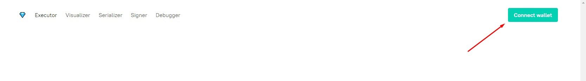
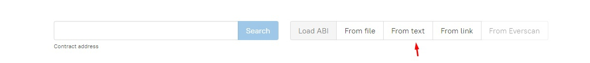
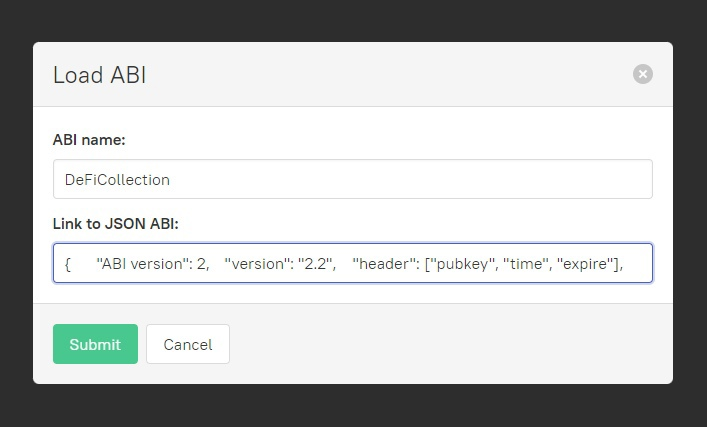
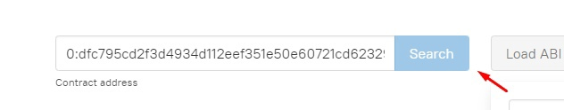
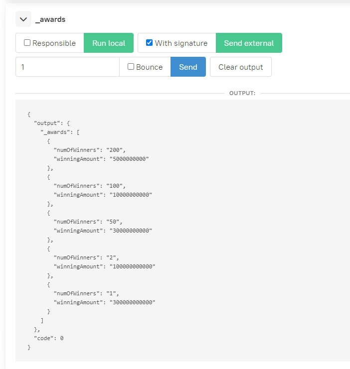

<h1>Popular questions:</h1>

To simplify method calls we used the service https://ever.bytie.moe/

First of all, you need to connect your ever wallet:



Next, you need to load the abi of the contract you want to interact with:




Enter the contract address and press "Search":



---

<h2>How many prizes are left?</h2>

Number of awards can be obtained by calling getter "_awards" and adding up the number of each award:

Choose "_awards" and press "Run local"


Next, you need to calculate the number_of_awards:

```
number_of_awards = 200 + 100 + 50 + 2 + 1 = 353
```

---

<h2>What are the chances of winning the lottery?</h2>
You can calculate the chances of winning the lottery using the following formula:

```
    number_of_awards / tickets_not_played
```
Number of awards can be obtained by calling getter "_awards" and adding up the number of each award:

Choose "_awards" and press "Run local"


Next, you need to calculate the number_of_awards:

```
number_of_awards = 200 + 100 + 50 + 2 + 1 = 353
```

Tickets not played can be obtained by calling the method "getTotalParticipants":


Thus, the probability of winning is equal to: 

```
353/4000 = 0,08825
```